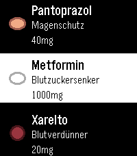
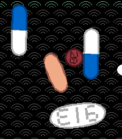

# ナース (Nāsu)

## Deutsch

**ナース (Nāsu)** ist eine native Medikamenten-Erinnerungs-App für die
**Pebble Time 2** (`emery`).

Wenn ein Medikament fällig ist, zeigt die Uhr die konfigurierten
Tabletten oder den Injektionspen, alarmiert per Ton und/oder Vibration
und wartet auf eine bewusste Bestätigung, bevor die Einnahme als
erledigt markiert wird.

<p align="center">
  
  
  
</p>

### Funktionen

- Bis zu **8 Medikamente**
- Tabletten und **Injektionspens**
- Tägliche, wöchentliche und monatliche Einnahmepläne
- Vier konfigurierbare Tageszeiten: Früh, Mittag, Abend und Nacht
- Einstellbare Tablettenform, Farbe, Größe und Beschriftung
- Einstellbare Farben für Pen und Akzent
- Tabletten fallen von oben in den Erinnerungsbildschirm und reagieren danach auf die Bewegung der Uhr
- Optionales Schweizer Wappen als festes Kollisionshindernis
- Optionales dezentes japanisches Hintergrundmuster
- **Gedrückthalten zum Bestätigen**
- Scrollen per Touch und Tasten
- Wiederholte Erinnerungen mit einstellbarem Intervall
- Alarmton mit einstellbarer Lautstärke
- Vibration ein/aus
- Oberfläche auf **Deutsch und Englisch**
- **Hell- und Dunkel-Theme**
- Persistenter Erinnerungsstatus
- Pebble-Wakeups

### Funktionsweise

Wird ein Medikament fällig, öffnet Nāsu einen eigenen
Erinnerungsbildschirm.

Tabletten verhalten sich wie kleine physikalische Objekte und reagieren
auf die Bewegung der Uhr. Injektionsmedikamente werden als animierter
Pen dargestellt.

Sind Tabletten und ein Pen gleichzeitig fällig, werden sie als getrennte
Bestätigungsgruppen angezeigt.

Eine Einnahme wird nicht durch einen kurzen versehentlichen Tastendruck
bestätigt. Stattdessen ist bewusstes Gedrückthalten mit visueller
Rückmeldung erforderlich.

### Konfiguration

Über die Begleit-Konfigurationsseite auf dem Smartphone können
Medikamente verwaltet werden.

Pro Medikament lassen sich unter anderem einstellen:

- Name
- Wirkung / Beschreibung
- Dosierung
- Menge
- Tageszeit
- Täglicher, wöchentlicher oder monatlicher Rhythmus
- Tablette oder Injektionspen
- Aussehen
- Aktiv / inaktiv

Allgemeine Einstellungen:

- Beginn von Früh, Mittag, Abend und Nacht
- Alarmton
- Alarmlautstärke
- Vibration
- Erinnerungsintervall
- Darstellung: Theme, Sprache, Schweizer Wappen und japanisches Hintergrundmuster

Bei einer frischen Installation richtet sich die Sprache zunächst nach der
Systemsprache der Pebble. Die Sprache kann anschließend in **Darstellung**
manuell auf Deutsch oder Englisch gestellt werden.

Die Einstellungen werden lokal gespeichert und über
**Pebble AppMessage** an die Uhr übertragen.

### Unterstütztes Gerät

- **Pebble Time 2 (`emery`)**

### Build

```bash
pebble clean
pebble build
```

Installation auf einer verbundenen Uhr:

```bash
pebble install --phone WATCH_IP
```

### Projektstruktur

```text
package.json
resources/
docs/
└── screenshots/
src/
├── c/
│   ├── main.c
│   ├── app_state.c
│   ├── app_util.c
│   ├── watch_settings.c
│   ├── medication_model.c
│   ├── medication_alarm.c
│   ├── medication_ui.c
│   ├── pill_physics.c
│   ├── pill_renderer.c
│   ├── scroll_controller.c
│   └── confirmation_ui.c
└── js/
    └── pebble-js-app.js
```

Weitere Architekturdetails stehen in
[`ARCHITECTURE.md`](ARCHITECTURE.md).

### Medizinischer Hinweis

Nāsu ist ein Komfortwerkzeug und **kein Medizinprodukt**.

Verlasse dich nicht ausschließlich auf diese App, wenn ein Medikament
exakt zu einem bestimmten Zeitpunkt eingenommen werden muss oder eine
ausgelassene beziehungsweise falsche Dosis gesundheitliche Folgen
haben kann.

### Lizenz

Nāsu ist freie Software unter der
**GNU General Public License v3.0**.

Siehe [`LICENSE`](LICENSE).

---

## English

**ナース (Nāsu)** is a native medication reminder app for the
**Pebble Time 2** (`emery`).

When medication is due, the watch displays the configured pills or
injection pen, alerts you with sound and/or vibration, and waits for a
deliberate confirmation before marking it as taken.

<p align="center">
  
  
  
</p>

### Features

- Up to **8 medications**
- Pills and **injection pens**
- Daily, weekly and monthly schedules
- Four configurable dayparts: morning, noon, evening and night
- Configurable pill shape, color, size and imprint
- Configurable pen body and accent colors
- Pills fall into the reminder screen from above and then react to watch movement
- Optional Swiss emblem as a fixed collision obstacle
- Optional subtle Japanese background pattern
- Deliberate **hold-to-confirm** interaction
- Touch and button scrolling
- Repeating reminders with configurable intervals
- Alarm sound with configurable volume
- Vibration on/off
- **German and English** interface
- **Light and Dark** themes
- Persistent reminder state
- Pebble wakeups

### How it works

When medication becomes due, Nāsu opens a dedicated reminder
screen.

Pills behave like small physical objects and react to movement of the
watch. Injection medications are displayed as an animated pen.

If pills and a pen are due at the same time, they are presented as
separate confirmation groups.

Medication is not marked as taken by a short accidental button press.
Confirmation requires a deliberate press-and-hold action with visual
feedback.

### Configuration

The companion configuration page lets you manage medications from your
phone.

For each medication you can configure:

- Name
- Effect / description
- Dosage
- Quantity
- Daypart
- Daily, weekly or monthly schedule
- Pill or injection pen
- Appearance
- Active / inactive state

General settings include:

- Morning, noon, evening and night start times
- Alarm sound
- Alarm volume
- Vibration
- Reminder interval
- Appearance: theme, language, Swiss emblem and Japanese background pattern

On a fresh installation, the app initially follows the Pebble system
language. Language can then be set manually to German or English under
**Appearance**.

Settings are stored locally and transferred to the watch through
**Pebble AppMessage**.

### Supported device

- **Pebble Time 2 (`emery`)**

### Build

```bash
pebble clean
pebble build
```

Install on a connected watch:

```bash
pebble install --phone WATCH_IP
```

### Project structure

```text
package.json
resources/
docs/
└── screenshots/
src/
├── c/
│   ├── main.c
│   ├── app_state.c
│   ├── app_util.c
│   ├── watch_settings.c
│   ├── medication_model.c
│   ├── medication_alarm.c
│   ├── medication_ui.c
│   ├── pill_physics.c
│   ├── pill_renderer.c
│   ├── scroll_controller.c
│   └── confirmation_ui.c
└── js/
    └── pebble-js-app.js
```

More details about the internal structure can be found in
[`ARCHITECTURE.md`](ARCHITECTURE.md).

### Medical disclaimer

Nāsu is a convenience tool and is **not a medical device**.

Do not rely on this app as the only safeguard for medication that must
be taken at an exact time or where a missed or incorrect dose could
cause harm.

### License

Nāsu is free software released under the
**GNU General Public License v3.0**.

See [`LICENSE`](LICENSE).
